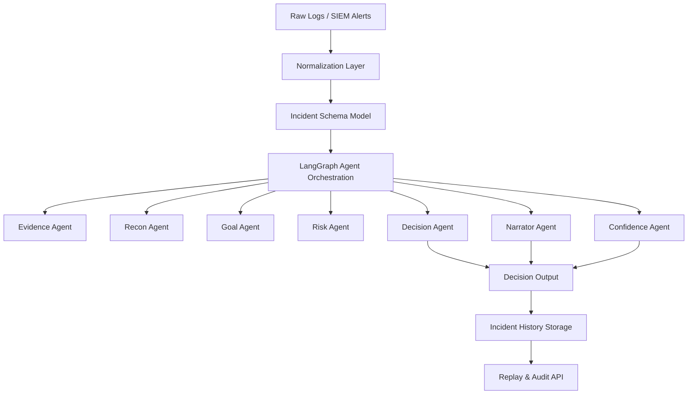
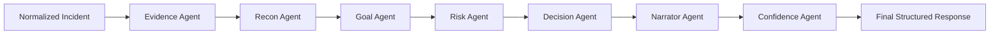
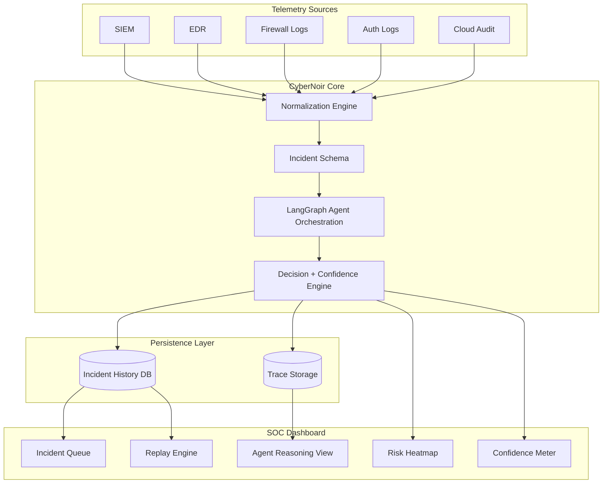

### Agentic Cybersecurity Intelligence — Explainable. Risk-Aware. Human-Centric.

> “In a world full of alerts… CyberNoir tells the story.”

---

## 🌃 What is CyberNoir?

CyberNoir is an **agent-based cybersecurity reasoning platform** that transforms raw logs and SIEM telemetry into:

- 🧠 Attacker behavior analysis  
- ♟️ Rational next-step simulation  
- 📊 Confidence-calibrated decisions  
- 📖 Plain-language security narratives  
- 🧾 Full reasoning trace for audit & replay  

Instead of just detecting events, CyberNoir **reasons about attacker intent, risk, and progression.**

---

## 🚨 Why CyberNoir?

Traditional systems:
- Trigger alerts  
- Match rules  
- Detect signatures  

But they don’t answer:
- *Why is this happening?*
- *What is the attacker trying to achieve?*
- *Will they escalate or wait?*
- *How confident are we in this conclusion?*

CyberNoir bridges the gap between **detection** and **understanding**.

---

## 🦸 The Agents Assemble

CyberNoir is not a single AI model.  
It is a coordinated team of reasoning agents.

### 🔍 Evidence Agent
Extracts confirmed and uncertain actions from normalized logs.

### 🛰️ Recon Agent
Assesses attacker visibility and exposure.

### 🎯 Goal Agent
Infers probable attacker intent (persistence, harvesting, escalation, etc.).

### ⚠️ Risk Agent
Evaluates escalation likelihood and detection probability.

### ♟️ Decision Agent
Selects the most rational attacker path under current constraints.

### 🎙️ Narrator Agent
Converts structured reasoning into clear, human-readable explanations.

### 📊 Confidence Agent
Calibrates uncertainty and assigns a confidence score.

---

## Architecture Overview

```yaml
Raw Logs / SIEM Alerts
↓
Normalization (Rules + ML Assist)
↓
Agentic Reasoning Graph (LangGraph)
↓
Decision + Narrative + Confidence
↓
Incident History & Replay
```
---


CyberNoir does not guess.  
It reasons.

---

## 🔄 Normalization Philosophy

Raw logs are noisy and vendor-specific.

CyberNoir translates them into structured facts:

- confirmed actions  
- non-actions  
- inferred actions (with uncertainty)  
- environment context  

This allows consistent, explainable reasoning across incidents.

---

## 🔐 Designed for Enterprise Reality

CyberNoir is built with:

- Deterministic core logic  
- ML used only as assistive inference  
- Full audit trail and replay capability  
- Confidence-aware output  
- Explicit reasoning trace  

It favors:
> Transparency over opacity.  
> Consistency over guesswork.  
> Explainability over black-box AI.

---

## 🛠️ Tech Stack

### Backend
- FastAPI
- LangGraph
- Pydantic
- SQLAlchemy
- SQLite (easily replaceable with PostgreSQL)

### Frontend
- React (Vite)
- Tailwind CSS
- Framer Motion

### AI Layer
- Configurable LLM client (Gemini / OpenAI / Ollama)
- ML-assisted inference (optional, controlled)

---

## 📊 Example Output

```json
{
  "decision": "maintain_access",
  "confidence": 0.74,
  "narrative": "The attacker gained access but avoided escalation due to elevated detection risk.",
  "trace": [
    "Credential use confirmed",
    "High visibility detected",
    "Escalation risk assessed as high",
    "Decision: Maintain Access"
  ]
}
```

---


## Getting Started


Prerequisites
-------------

Make sure you have the following installed:

*   Python 3.10+
*   Git

Optional:

*   PostgreSQL (if not using SQLite)
*   Docker (for containerized setup)

* * *

1\. Clone the Repository
------------------------

```bash
git clone https://github.com/HarshalMPatil20/CyberNoir.git
cd cybernoir
```

* * *

2\. Backend Setup (FastAPI + LangGraph)
---------------------------------------

Navigate to the backend directory:

```bash
cd backend
```

Create a virtual environment:

```bash
python -m venv venv
```

Activate the virtual environment:

Windows:

```bash
venv\Scripts\activate
```

Mac/Linux:

```bash
source venv/bin/activate
```

Install dependencies:

```bash
pip install -r requirements.txt
```

* * *

3\. Environment Configuration
-----------------------------

Create a `.env` file inside the `backend/` directory.   
Sample env is present.

Example:

```
LLM_PROVIDER=gemini
DATABASE_URL=sqlite:///./cybernoir.db
LOG_LEVEL=INFO
```

If using Gemini or another LLM provider:

```
GEMINI_API_KEY=your_api_key_here
```

* * *

4\. Run the Backend Server
--------------------------

```bash
uvicorn app.main:app --reload
```

Backend will run at:

```
http://localhost:8000
```

Swagger API documentation:

```
http://localhost:8000/docs
```

* * *


* * *

5\. Test the API
----------------

Example endpoint:

```
POST /incident/analyze
```

Sample request body:

```json
{
  "initial_vector": "credential_access",
  "confirmed_actions": ["login_success", "credential_use"],
  "non_actions": ["no_lateral_movement"],
  "environment_context": {
    "mfa_enabled": false,
    "endpoint_monitoring": false,
    "network_segmentation": false
  },
  "audience_level": "technical"
}
```

Expected response includes:

*   Decision
*   Narrative
*   Confidence score
*   Full reasoning trace

* * *

## 7\. Project Structure


```
backend/
  ├── app/
  │    ├── agents/
  │    ├── api/
  │    ├── core/
  │    ├── db/
  │    └── main.py
  └── requirements.txt
```


---

## System Architecture



## Agent Reasoning Flow



---

## SOC Dashboard Architecture




